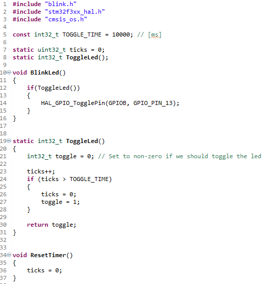

# Assembler lab

In the second lab we will write our first assembly function and learn how to use instruction stepping mode to step through it.

## Increasing a number

We are going to expand on the lab from last week. The blinking function we implemented worked well, but someone else needs the computational power and have asked us to re-write our part in inline assembler.

You are provided with one solution to last weeks problem, implemented in blink.c, which increases a static variable every loop (1 ms) until it passes 10000. The led is then toggled and the counter is reset to 0.



To start of, we should replace the `ticks++` with some assembler code. The following code is a good starting point. It declares `ticks` as a read and write output and moves it to the `r1` register. Then it moves the the value of the `r3` register to `ticks`. Inbetween these lines we need to increment the value of `r1` by 1 and make sure it ends up in `r3` before `r3` is written to `%[ticks]`

```
asm(
    "       mov r1, %[ticks]    \n\t"
    "       mov %[ticks], r3    \n\t"
    : [ticks] "+r" (ticks)
);
```

Remember that you can always look up which operators are available and how they work on th [ARM website](https://developer.arm.com/documentation/dui0473/m/arm-and-thumb-instructions).

You can also take a peak at other assembly code in the disassembly in STM32CubeIDE or the examples provided. Feel free to test your code either on target or using QEMU depending on what you prefer, in the end, we want it to run on the devkits though.

## Implementing an if statement

Even thought we changed the ++-operation to be assembly, this wasn't enough. We need to also implement the if statement in assembler as well. Update the end of your asm block so we add `toggle` as a read only output and `TOGGLE_TIME` as a read only input.

```
asm(
    YOUR
    CODE
    HERE
    : [ticks] "+r" (ticks),
      [toggle] "=r" (toggle)
    : [TOGGLE_TIME] "r" (TOGGLE_TIME)
);
```

You should now be able to update your assembler code to replicate the behavior of the if statement. Remeber that you can always use the IDE to look at the register values and inspect the disassembly. The examples provided might also prove useful.

With these updates, the code is running smoothly again and your colleague got all the resources needed.

(Note that in reality, it is usually less efficient to try to write your own assembly code compared to letting the compiler do it for you.)