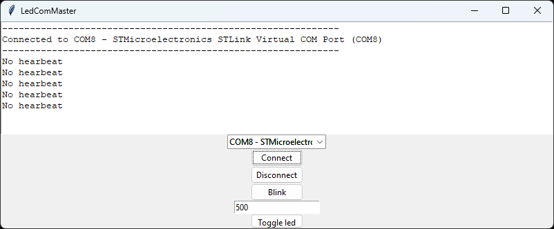

# Communications lab

In the last lab we will implement a small communication interface to communicate with a PC.

## Sending heartbeats
The blinking led product has become a great success and production is about to start. Your colleague working at the test department needs some help with the end of line (EOL) testing. To be able to test everything a test software should be available on the processor which should communicate with the test equipment using UART.

Your colleague has written a small program which the device under test (DUT) needs to communicate with (comMaster.exe) with a few commands.

The first requirement is a heartbeat from the DUT. Every 100 ms the DUT should send the string "1001" on UART so the test equipement can determine that the DUT is present.

```
commandName     commandNumber   commandValue
Hearbeat        1001            -         

Format:
commandNumber\n
```

Last week we already used the function `UartPrint()` to send data over UART, if we can make sure it sends the correct command with the correct frequency this shouldn't be a problem. We also know that `ButtonToggle()` is called every 100 ms.

When you launch `comMaster.exe` a window should pop up where you can connect and disconnect to the proper COM port. It also has some other functions we will look into later.


When we connect we just recieve the information that there's no heartbeat. Our first step is to send the hearbeat command at a proper interval. If correctly implemented the text box in comMaster should change to indicate that heartbeats have been recieved.

Note, the person who implemented comMaster.exe is possibly not qualified to make PC software so it might be a bit buggy. For example, it won't start if you don't have any COM ports so you need to connect the DevKit before launching the program.

## Toggle led on command
Once we got the heartbeats working we should implement the toggle led command. Your colleague has implemented the command as follows:
```
commandName     commandNumber   commandValue
Hearbeat        1001            -         
ToggleLed       2002            0/1         0=led off, 1=led on

Format:
commandNumber\tcommandValue\n
```
For example, if we recieve `2002\t0\n` on UART we should turn the led off.  `uart_com.c` declares a function called `UartRecieve()` which can be used to read recieved messages on UART. It is currently empty, you need to use `HAL_UART_Receive()` similar as to the `UartTransmit()` function.

By pressing the `Toggle Led` button in comMaster it will iterate between sending commands to turning the led on and off.

Implement the command such that the led turns on when receiving the led on command and turns off when receiving the led off command.

## Blink led on command
The last test required to be performed is the blink functionality. Your colleague has implemented a command for this as well. The full command table looks like follows.
```
commandName     commandNumber   commandValue
Hearbeat        1001            -         
BlinkLed        2001            0-10000     ms the led should be on and off
ToggleLed       2002            0/1         0=led off, 1=led on


Format:
commandNumber\tcommandValue\n
```
If we recieve `2001\t500\n` the led should be on for 500 ms then off for 500 ms. Thankfully, we already have the blink function implemented in `blink.c`, some adaptions will be needed though.

By pressing the `Blink` button in comMaster it will transmit the command, you can change the time by inputing requested amount of milliseconds in the box below the button.

Implement the blink command such that the led starts to blink with the desired frequency when the command is sent. The DevKit should always use the latest recieved command, i.e. if it's currently blinking and recieves a led on command the led should stop blinking and be turned on until another command is reveived.

Once this is implemented the test software is complete and your blinking led product is ready for launch, celebrate appropriately. 