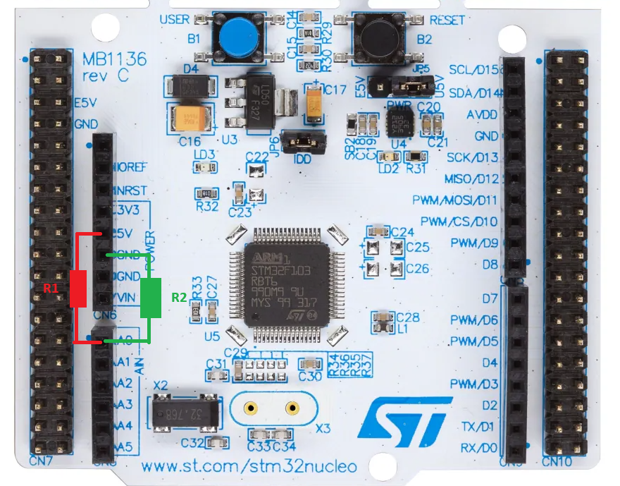
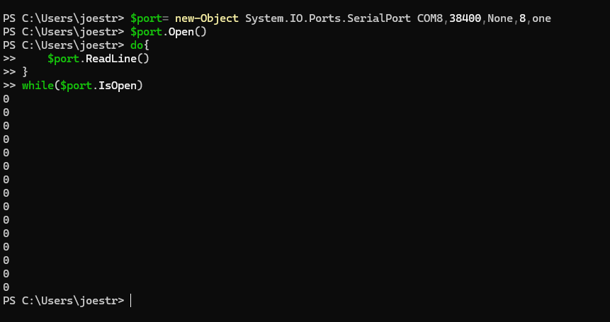
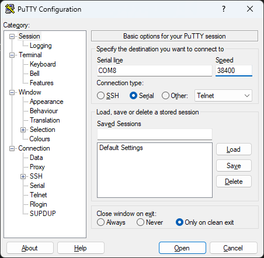
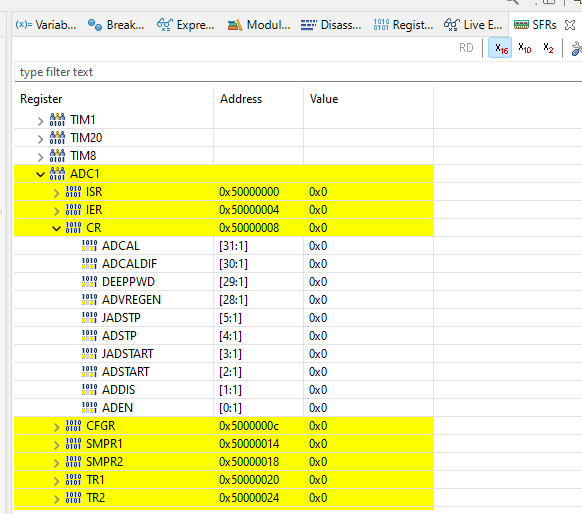

# Electronics lab

In the third lab we will write out first driver to read from an analog to digital converter.

## Implementing the driver 

The blinking led from last week was a great success, however, there have been requests on being able to automate the process. Pushing the button was just to cumbersome, instead it is desired to use an analog signal to indicate whether the the led should be lit or not. If the input voltage is 2-3 V the led should be lit, otherwise it should be turned off. With this automation there is no longer any need for the led to blink every 10 seconds.

There are also some legal issues with the STM32 HAL drivers meaning you will need to write the drivers yourself instead of just calling the already included HAL drivers.

In the provided project button_toggle.c has been modified and most of the logic is already implemented, the only missing part is the driver part.


### Selecting resistors
To start of, we need to get a voltage input to test with. We will connect two resistors between the 5V output and the A0 input (connected to ADC1) and the A0 input and GND.


Since 5V is to large for input to our processor we need to make a voltage divider to get a proper input. Select good values for R1 and R2 to get a voltage between 2 and 3 volts at A0. Since we only need the voltage, it is recommended to use resistors of at least 10k Ohm. If you would like to simluate your selection, [LTSpice](https://www.analog.com/en/resources/design-tools-and-calculators/ltspice-simulator.html) is a great free tool.

If you have access to a multimeter you can also use this to measure that you got the expected value.

### Printing values on UART
In the AdcHigh-function there is a UartPrint implemented which prints the estimated mV. This is another way to debug your code without using the debugger. There are several ways to access the COM port. Once you have compiled your code on target you can use powershell by running the following command, just change the COM port to correspond to the COM port your DevKit is connected to.

```
$port= new-Object System.IO.Ports.SerialPort COM8,38400,None,8,one
$port.Open()
do{
    $port.ReadLine()
}
while($port.IsOpen)
```


You can also use [PuTTY](https://www.putty.org/).



On Linux it should be possible to use screen for this, but I didn't manage to get it working with WSL. (Let me know if you solve that :))

### Initializing the driver
Once our resistors are selected and connected we are ready to start with the driver. The first thing to do is to initialize it properly. The AdcInit function is called in the main function together with all the other initializers.

We can read more about how the ADC works in the [reference manual](rm0365-stm32f302xbcde-and-stm32f302x68-advanced-armbased-32bit-mcus-stmicroelectronics.pdf), also available in the repo.

We have already got some help with clocks being enabled, so the first thing we need to do is to enable the ADC Voltage Regulator in the control register accessible in `ADC1->CR`. Since we only need to change certain registers we need to utilize bitwise and and bitwise or to only change certain bits in the registers without affecting other functionality.

When the voltage regulator is enabled, we will need to setup the sequence register. Since we're only reading one analog signal we need a sequence length of one, and we need the first conversion in regular sequence to use channel 1. We can access this with `ADC1->SQR1`.

Finally, we can enable the ADC through the control register `ADC->CR` and then wait for interrupt and service register `ADC1->ISR` to be reach a state where it is ready to accept conversion requests.

Once the ISR is ready the driver is initialized. When testing with this, remember that you can look at the SFR tab in STM32CubeIDE to get the values of the registers while debugging.



Keep in mind that some registers are write only, meaning they will always show up as 0 in this view, even after you've written to them.

Another tip is that there are defines available for most registers. For example, if you would like to write to the ADSTART bit in the CR register instead of writint `ADC1->CR |= (1U << 2);` you can write `ADC1->CR |= ADC_CR_ADSTART;` which will keep your code a bit cleaner and easier to read.

It might be difficult to verify that the initalization worked as intended without actually reading the data so let's move on to the next part.

### Getting the mV

Once the ADC is initialized we should be able to use the ADC. First we need to start a regular conversion by writing to `ADC1->CR`, note that after a conversion this is stopped by the processor automatically so we need to start a conversion every time we would like to read the data. 

We then need to find a suitable ADC1 register where our data might end up and read this value. 

Once we've recieved the rawValue from the ADC, we need to calculate the actual voltage. The ADC on the STM32 is a 12 bit ADC with an AD_Ref of 3.3V, meaning that 0xFFF corresponds to a voltage of 3.3V. We need to scale our AD value to correspond to the actual voltage, in this case in mV since the limits are given as mV.

Once `mV` is properly calculated we should have a function where the led is on while `R1` is connected on off when it is not. You should be able to add and remove it to toggle the led. Feel free to try with other resistors and see how it behaves.

Note that this is a very basic ADC driver. In general, there are a lot of other aspects to consider. You might notice (depending on your solution) that the first conversion of the register always becomes 0, and if you remove R1 the voltage doesn't become quite zero, as you would expect. For the automation of the led toggle function this is enough and your project manager is happy with the results, so we'll leave it here, but for future projects there might be a need for more detailed initialization and sampling. Or you can just use the HAL drivers provided by the manufacturer.