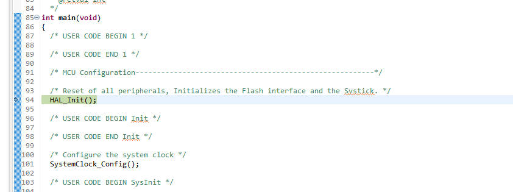
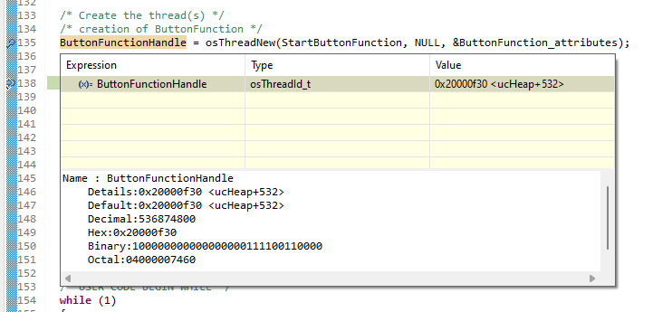
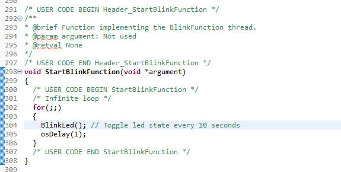
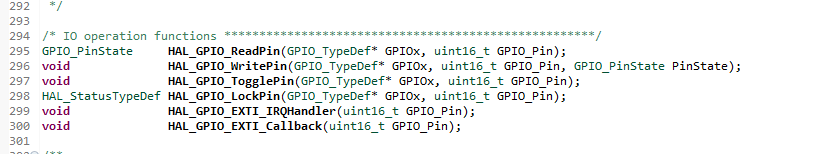
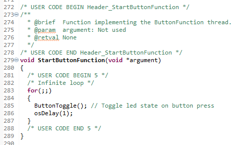

# Introduction Lab
In the first lab we will learn the basics around our environment and the OS we are using. To do this we need [STM32CubeIDE](https://www.st.com/en/development-tools/stm32cubeide.html). 

## Run, build and debug code
A starting point for the lab is available in the IntroductionLab folder. Open the .project file in STM32CubeIDE to view the code. You should now be able to build the project, by pressing Ctrl+B or the hammer in the toolbar.
 

If we have the devkit connected we should also be able to debug the code on target. Pressing F11 or the insect in the toolbar will trigger a debug.  

This will automatically build the project, upload it to target and start a debugging session by breaking on the first line in main(). If prompted to switch view when starting a debugging session it is recommended to switch.



When debugging we are able to step through our code, as you would expect when debugging on your local machine, by using the buttons on the task bar. 


We can also add breakpoints by clicking the blue area on the corresponding line and and examine variables by hovering over them.



We will talk more about debugging embedded software in the next session, these possibilities should be enough for this lab. If you are able to get this far, you are ready to start coding!

## Implement blink functionality

Our first task is to make the green led, marked as LD2, on the board toggle every 10th second.

The project is already setup to initalize low level drivers properly so we don't need to worry about that. We are only going to edit files located in the Core-folder. Four new files are added here, blink.c, blink.h, buttontoggle.c and buttontoggle.h. For now, we are only interested in the blink-files.

The blink module includes an empty function BlinkLed() which is called from main in BlinkFunction thread started at StartBlinkFunction()



The led is connected to GPIO_PIN_13 in the GPIOB group. These are available as defines from the HAL software. There are some useful function also available from the HAL software.



For time measurements there are a few differen options.

```
osDelay()
HAL_Delay()
HAL_GetTick()
```

This should be enough to implement a blinking function. Try to solve this by only implementing the BlinkLed() function in blink.c

## Implement button functionality
10 seconds is a long time. Sometimes we don't have time to wait. We would like to toggle the led when pushing the blue button, marked as B1 on the board.

The buttontoggle module includes a function ButtonToggle() which is called in ButtonFunction thread started in StartButtonFunction in main.



This button is connected to GPIO_PIN_13 in the GPIOC group.

The same HAL function should be enough to implement this feature. Make sure that the led is only toggled once regardless of how long the press is. The blink function already implemented should still toggle the led every 10 seconds since startup.

Try to solve this by only implementing the ButtonToggle() function.

## Reset blink timer on button functionality

The button toggle could sometimes sync up with the blink function which was quite confusing. When pushing the button we should also reset the timer of the blink function. Let button_toggle.c include blink.h and add and implement appropriate functions.

Try to solve this by only changing blink.c, blink.h, button_toggle.c and button_toggle.h.

If successful, we have now achieved cutting edge technology in led blinking devices. Well done! 

Feel free to play around more with the project and see what else you can achieve.